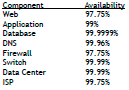
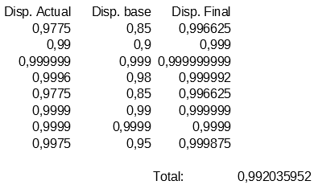

# Ejercicios Tema 2

## T2.1: Calcular la disponibilidad del sistema si tenemos dos réplicas de cada elemento (en total 3 elementos en cada subsistema)

> Disponibilidad replicando cada elemento una vez

> Disponibilidad replicando cada elemento dos veces

Utilizamos la fórmula vista en clase As = Acn-1 + ( (1 – Acn-1) * Acn ) para cada elemento del sistema y obtenemos que si replicamos cada uno de ellos obtenemos una disponibilidad total del sistema del 99.203%.

## T2.2: Buscar frameworks y librerías para diferentes lenguajes que permitan hacer aplicaciones altamente disponibles con relativa facilidad

- **Symfony**: es uno de los frameworks más usados para el desarrollo web.
- **Django**: Escrito en Python. Django pone énfasis en el re-uso, la conectividad y extensibilidad de componentes, el desarrollo rápido y el principio No te repitas.
- **CakePHP**: gestión de las sesiones mejorada, librerías independientes y componentes modulares para reducir el peso.
- **Spring MVC**: (Java) ofrece una amplia gama de servicios: API REST, servicios web SOAP, seguridad, etc.

## T2.3: ¿Cómo analizar el nivel de carga de cada uno de los subsistemas en el servidor? Buscar herramientas

- El directorio proc: Es una carpeta en RAM utilizada por el núcleo de Unix para facilitar el acceso del usuario a las estructuras de datos del S.O.
- uptime: Tiempo que lleva el sistema en marcha y la "carga media que soporta"
- ps: Información sobre el estado actual de los procesos del sistema.
- Top - htop: Muestra cada T segundos: carga media, procesos, consumo de memoria... Se suele ejecutar de forma interactiva.
- vmstat: paginación, swapping, interrupciones, cpu..
- sar: es un monitor de actividad utilizado por los administradores de sistemas Unix para, entre otras cosas, la detección de cuellos de botella.
- Nagios: Permite la monitorización y la generación de alarmas de equipos distribuidos en red. Se puede personalizar mediante la programación de plugins propios.
- Otras herramientas parecidas a Nagios son: Ganglia, Munin, Zabbix, Pandora FMS...

## T2.4: Buscar ejemplos de balanceadores software y hardware

- Software: Nginx, haproxy, Seesaw, Zevenet, Neutrino, Balance, Pen.
- Hardware: F5, Cisco, Citrix, Kemp, Barracuda, radware, Zen.