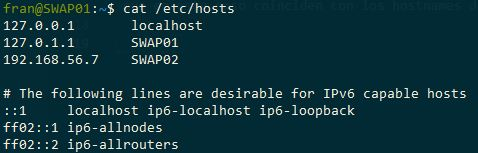
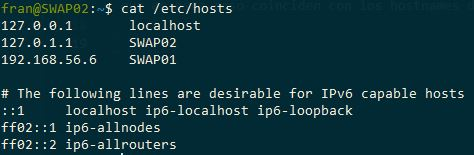
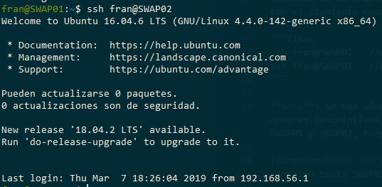
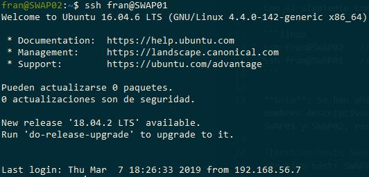
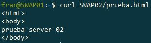
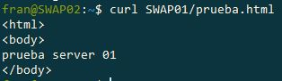

# Práctica 1. Preparación de las herramientas

Documentación relativa a la práctica 1 de la asignatura relacionada con las instalación de las máquinas en nuestros equipos y la comprobación del correcto funcionamiento de las mismas.

Como entorno de virtualización se ha usado VirtualBox en su versión 6.0 y como SO se ha utilizado Ubuntu Server 16.04.

Tras la instalación de las dos máquinas llamadas SWAP01 y SWAP02 se ha comprobado el correcto funcionamiento de las mismas y la conectividad entre ellas realizando las siguientes pruebas.

## Conexión por ssh

Situados en la máquina SWAP01 nos conectamos por ssh a la otra máquina (SWAP02) con el siguiente comando:

```linux
ssh fran@SWAP02   //desde SWAP01
ssh fran@SWAP01   //desde SWAP02
```

**Nota**: Se han añadido en ambas máquinas la ip de la otra y se le han dado nombres descriptivos, que en este caso coinciden con los hostnames de las mismas SWAP01 y SWAP02, respectivamente.


>Archivo hosts SWAP01


>Archivo hosts SWAP02


>Conexión por ssh desde SWAP01 contra SWAP02


>Conexión por ssh desde SWAP02 contra SWAP01

## Acceso a través de curl

Se han creado unos ficheros html (en el directorio /var/www/html) en ambas máquinas para comprobar el funcionamiento del servidor apache. Hemos accedido a estas máquinas a través de curl de la siguiente forma:


>Conexión a través de curl y comprobación de funcionamiento del servidor SWAP02 desde SWAP01


>Conexión a través de curl y comprobación de funcionamiento del servidor SWAP01 desde SWAP02

## Creación de un fichero remoto por ssh

En este ejemplo hemos creado un fichero *prueba* en la máquina SWAP02 conectados a través de ella de la siguiente forma:


>Fichero creado conectado a través de ssh desde SWAP01


>Se conecta directamente a la máquina SWAP02 para comprobar que efectivamente se ha creado el fichero