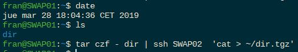
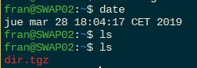
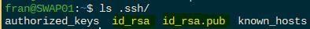
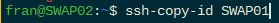
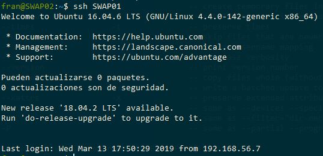
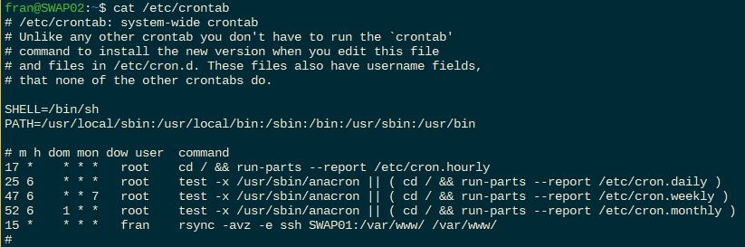
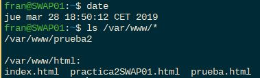
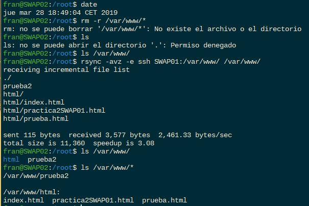

# Práctica 2. Clonar la información de un sitio web

## Crear un tar con ficheros locales en un equipo remoto

Para crear un archivo tar en un equipo remoto usamos el siguiente comando:

```linux
tar czf - directorio | ssh equipodestino 'cat > ~/tar.tgz'
```

De esta forma creamos en *equipodestino* el archivo *tar.tgz* sin que se guarde en el equipo local pasando la salida estandar directamente al **ssh**.




>Copia del directorio *dir* desde SWAP01 en la máquina SWAP02 a través de **ssh**

## Acceso sin contraseña para ssh

Para acceder sin contraseña desde un equipo a otro a través de **ssh** hacemos uso de un par de claves pública-privada. Para ello las generamos con el siguiente comando:

```linux
ssh-keygen -b 4096 -t rsa
```

Que nos genera las siguentes claves en el directorio .ssh del usuario que las genera:


>Marcadas en amarillo en la imagen

A continuación, lo que hacemos es copiar nuestra clave pública en el equipo remoto de una forma muy sencilla con el siguiente comando que incorpora **ssh**:


>Nota: recordar que hemos modificado el archivo hosts en la práctica anterior para darle un nombre a cada IP en ambos equipos

Este comando copia en el fichero ~/.ssh/authorized_keys de la máquina SWAP01 la clave pública de SWAP02. Que nos permitirá finalmente conectarnos y ejecutar cualquier comando remoto sin necesidad de contraseña.




## Programar tareas con crontab

Para programar automatización de tareas usaremos el demonio **cron** que se encarga de ejecutar todos los procesos indicados en el fichero */etc/crontab*.
En nuestro caso vamos a programar el clonado periódico del directorio */var/www* de SWAP01 en SWAP02, para ello añadimos la siguiente línea al fichero crontab:



Aquí podemos ver que se ejecutará el comando rsync en el minuto 15 de cualquier hora en cualquier día, es decir, se hará una copia de todo el contenido cada hora todos los días.

En el siguiente ejemplo vamos a comprobar el correcto funcionamiento de rsync y la ejecución de comandos remotos sin contraseña por ssh:

>Contenido /var/www SWAP01



Aquí podemos comprobar como se ha hecho el clonado completo del contenido de */var/www* de SWAP01 en la máquina de respaldo SWAP02.