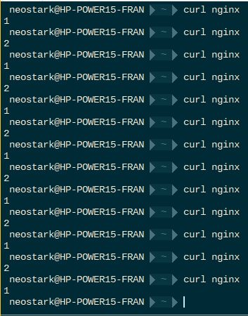
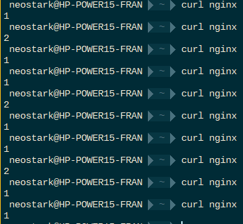
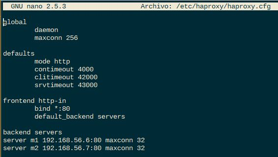
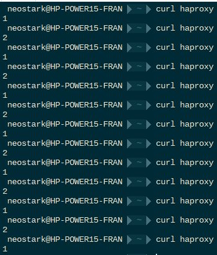
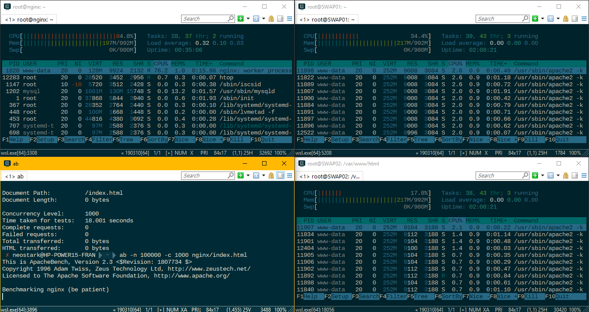
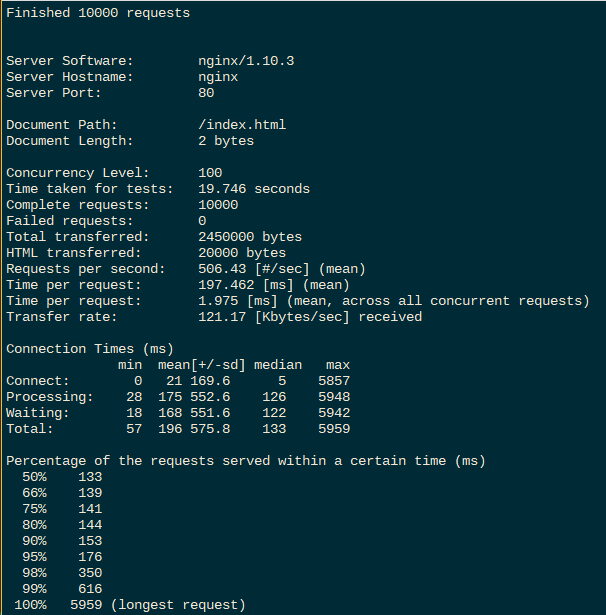
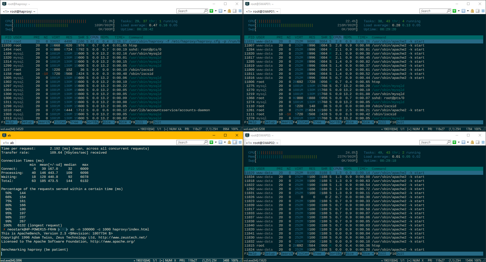
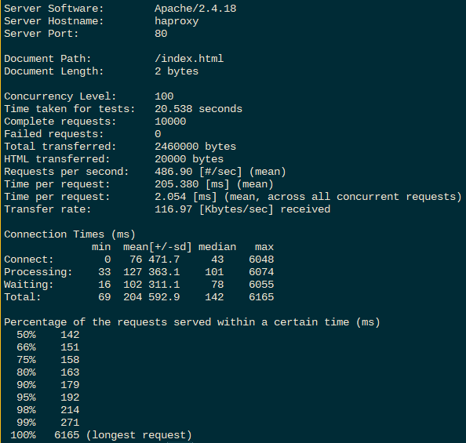

# Práctica 3. Balanceo de carga

## Configuración de balanceadores

Para instalar los servidores web usamos:

```linux
sudo apt install nginx
sudo apt install haproxy
```

Una vez instalado los servidores a usar como balanceadores de carga (en este caso nginx y haproxy) se hará la configuración introduciendo los siguientes parámetros en los ficheros de configuración correspondiente.

### Servidor Nginx


En la captura anterior podemos ver la configuración introducida en el fichero */etc/nginx/conf.d/default.conf* en la que se declaran los dos servidores en los cuales se va a llevar a cabo el balanceo, que en este caso será round robin. Podemos ver un ejemplo en la siguiente captura:



Captura que muestra el algoritmo de ponderación:



>El servidor 1 tiene un peso de 2 frente al servidor 2 que tiene un peso de 1.

### Servidor haproxy



Al igual que el caso anterior configuramos el balanceador para que distribuya la carga siguiendo el patrón round robin entre los dos servidores. A continuación se muestra un ejemplo de su funcionamiento:



## Someter a una alta carga el servidor balanceado

Para medir el rendimiento de nuestros servidores y si se distribuye de forma correcta la carga usaremos la herramienta *Apache Benchmark* para someter a nuestro balanceador y servidores finales a una alta carga y ver de que forma reacciona.

### Servidor nginx



Al estar configurado el balanceador con el algoritmo de ponderación podemos observar que el servidor 1 recibe el doble de carga que el 2.




### Servidor haproxy



En este caso podemos ver como ambos servidores reciben una carga equitativa, ya que los dos tienen el mismo peso



Tras ver los tiempos medios que da *Apache benchmark* ejecutado con los siguientes parámetros:

``` linux
ab -n 100000 -c 1000 nginx/index.html
```

Podemos observar como nginx tiene un rendimiento algo superior con un tiempo de respuesta de 196ms de media frente a los 204ms de haproxy.