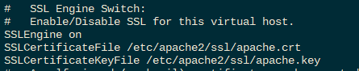
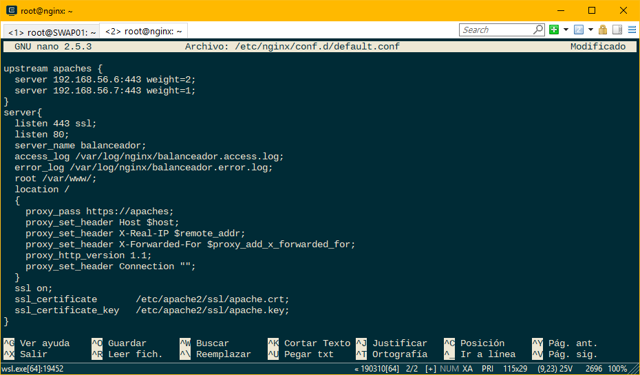
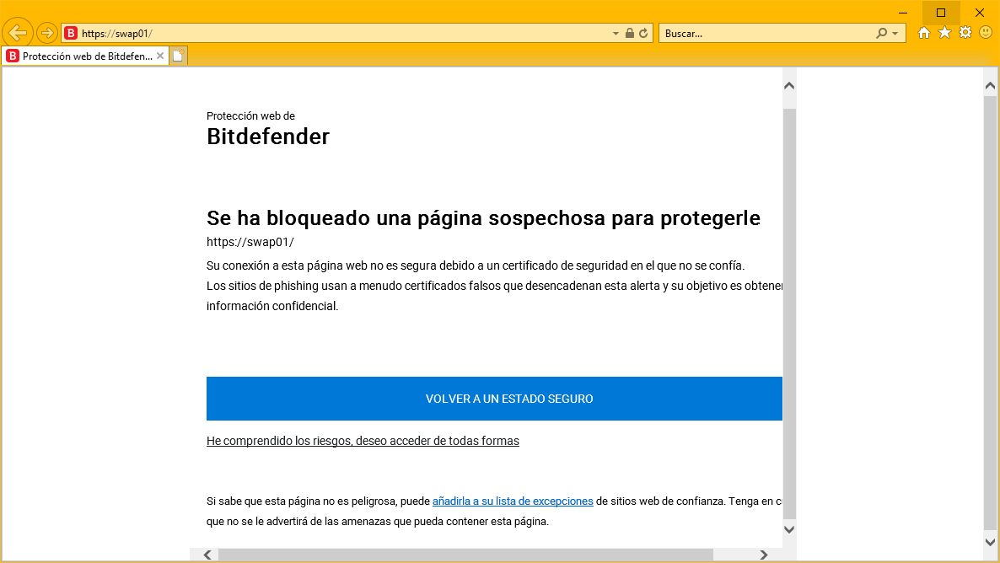
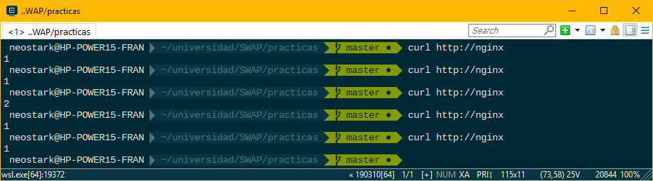
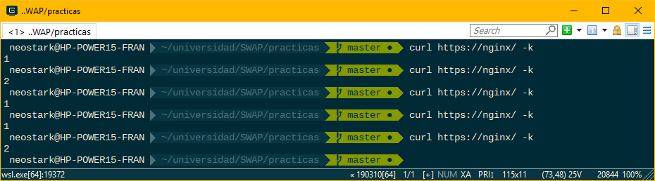
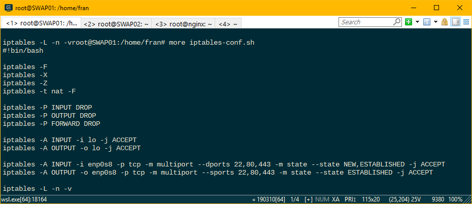
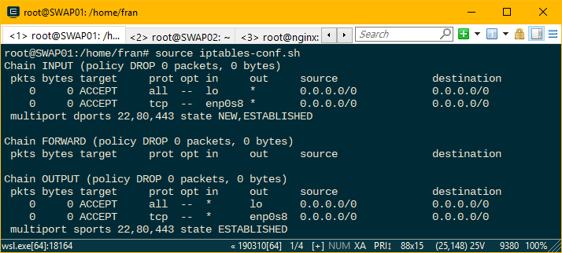
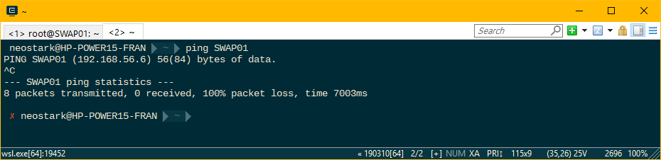

# Práctica 4. Asegurar la granja web

En esta práctica se han llevado a cabo diversas configuraciones para aumentar la seguridad de nuestra granja web. Para ello hemos configurado https a través de ssl tanto en nuestros servidores finales como en el balanceador nginx e iptables como cortafuegos en uno de nuestros servidores finales.

## Instalar un certificado SSL autofirmado y configurar el acceso por HTTPS

En primer lugar, para generar un certificado autofirmado necesitamos activar el módulo de apache de ssl para ello ejecutamos los siguientes comandos:

    a2enmod ssl
    service apache2 restart

Posteriormente generamos nuestro certificado autofirmado con la herramienta openssl, especificándole la ruta donde almacenar los certificados:

    mkdir /etc/apache2/ssl
    openssl req -x509 -nodes -days 365 -newkey rsa:2048 -keyout /etc/apache2/ssl/apache.key -out /etc/apache2/ssl/apache.crt

Tras generar nuestro certificado lo añadimos sus rutas al archivo de configuración de apache editando el fichero default-ssl.conf:

Por último activamos el sitio default-ssl y reiniciamos apache:

    a2ensite default-ssl
    service apache2 reload

De esta manera ya estaría configurado apache para funcionar a través de https. Esta misma operación la repetimos con el resto de servidores de nuestra granja, con la única diferencia de que en vez de generar nuevos certificados se han copiado desde este servidor con la herramienta scp de la siguiente manera:

    scp /etc/apache2/ssl/* fran@SWAP02:/home/fran

Por último nos quedaría configurar nuestro balanceador nginx para que funcione con https, para ello añadimos las siguientes líneas a su archivo de configuración:

Con esto quedaria configurado por completo toda nuestra granja web. Aquí varios ejemplos de su funcionamiento:

> En este ejemplo vemos como los antivirus y exploradores detectan como el certificado de nuestra página es autofirmado y nos bloquea su visualización con el objetivo de protegernos ya que no puede certificar la validez y el origen de ese certificado.

> Aquí podemos ver como aún sigue funcionando las consultas a través del puerto 80 de http y como sigue balanceando la carga. *Recordar que nginx está configurado con un algoritmo de ponderación dando más peso al servidor 1.

> Y aquí como funciona a través del puerto 443 de https.

## Configuración del cortafuegos

Para esta práctica hemos decidido que usaremos como cortafuegos la herramienta de linux *iptables*. Mostraré el script que se ha configurado para nuestro servidor SWAP01 y posteriormente se explicará que hace cada línea:

El primer bloque lo que hace básicamente es borrar todo el contenido que tiene actualmente la tabla y empezar a configurar nuestras reglas en un entorno limpio.

El segundo bloque se encarga de bloquear todo el tráfico de todas nuestras interfaces.

En el tercer bloque aceptamos el tráfico entrante y saliente en nuestra interfaz local.

Y por último, en el cuarto bloque aceptamos el tráfico de entrada y salida de la interfaz enp0s8, para el protocolo tcp en los puertos 22,80,443 que corresponden a los servicios de SSH, HTTP y HTTPS. Notar que para evitar repetir las mismas reglas para los tres puertos hemos usado la opción *multiport*.

La tabla que nos muestra iptables resultante es la siguiente:

De esta manera quedaría configurado nuestro cortafuegos en el servidor SWAP01.

> Aquí vemos como no es posible hacer ping al servidor ya que el cortafuegos está configurado para interceptar ese tipo de paquetes.