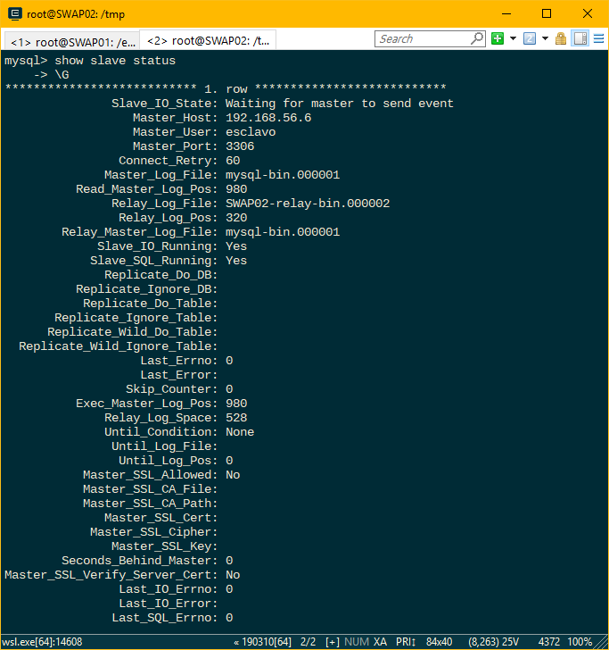

# Práctica 5. Replicación de bases de datos MySQL

En esta práctica se ha configurado las bases de datos de nuestros servidores para replicar los datos que introducimos en el servidor 1 (maestro) en el servidor 2 (esclavo), para de esta forma mantener un backup del servidor principal en el servidor de respaldo.

## Configuración previa. Crear BBDD e introducir datos

A partir de ahora suponemos que hemos entrado al terminal de mysql como usuario root con el siguiente comando:

    mysql -u root -p

En primer lugar, creamos la base de datos en MySQL para ello ejecutamos los siguientes comandos desde la interfaz de MySQL:


```sql
    mysql> create database libreria;
    mysql> use libreria;

    mysql> CREATE TABLE IF NOT EXISTS `libros` (
    `ISBN` varchar(13) COLLATE utf8_spanish_ci NOT NULL,
    `titulo` varchar(100) COLLATE utf8_spanish_ci NOT   NULL,
    `autor` varchar(100) COLLATE utf8_spanish_ci NOT  NULL,
    `portada` varchar(100) COLLATE utf8_spanish_ci NOT  NULL,
    `editorial` varchar(100) COLLATE utf8_spanish_ci NOT  NULL,
    `precio` float NOT NULL,
    `genero` varchar(30) COLLATE utf8_spanish_ci NOT  NULL,
    PRIMARY KEY (`ISBN`));

    mysql> INSERT INTO `libros` (`ISBN`, `titulo`, `autor`, `portada`, `editorial`, `precio`, `genero`) VALUES
    ('1234567890123', 'El nombre del Viento', 'Patrick Rothfuss', '/img/elNombreDelViento.jpg', 'Salamandra', 19.9, 'Ciencia ficción'),
    ('12312331', 'El temor de un hombre sabio', 'Patrick Rothfuss', '/img/elTemorDeUnHombreSabio.jpg', 'Salamandra', 24.9, 'Ciencia ficción'),
    ('3453453453456', 'Juego de Tronos', 'George R.R. Martin', '/img/juegoDeTronos.jpg', 'Santillana', 19.9, 'Ciencia ficción')
```

## Replicar BD MySQL con mysqldump

Antes de poder replicar las tablas de la BD que hemos creado anteriormente con mysqldump debemos bloquear las tablas que vayamos a clonar para que no se pueda añadir contenido adicional mientras se realiza el clonado. Para ello en el Servidor 1 hacemos:

    mysql> FLUSH TABLES WITH READ LOCK;

Ahora si podemos clonar los datos:

    mysqldump libreria -u root -p > /tmp/libreria.sql

Por último desbloqueamos las tablas de la BD:

    mysql> UNLOCK TABLES;

Ahora copiamos el archivo .sql que hemos creado a la máquina 2 usando scp desde la máquina 1:

    scp /tmp/libreria.sql SWAP02:/tmp/

Una vez copiado el archivo a la segunda máquina, creamos una BD con el mismo nombre (ya que mysqldump no genera la orden para crear la BD) y posteriormente volcamos los datos en esa BD:

    mysql> CREATE DATABASE ‘libreria’;
    mysql> quit
    mysql -u root -p libreria < /tmp/libreria.sql

## Replicación de BD mediante una configuración maestro-esclavo

En primer lugar debemos modificar los ficheros de configuración de mysql de ambos servidores. El fichero en cuestión es */etc/mysql/mysql.conf.d/mysqld.cnf* y deberá tener el siguiente contenido:


> La configuración del servidor 1 es la misma que la del servidor 2, cambiando el server-id por 1

Ahora creamos un usuario en el maestro y le damos permiso para replicación:

```sql
mysql> CREATE USER esclavo IDENTIFIED BY 'esclavo';
mysql> GRANT REPLICATION SLAVE ON *.* TO 'esclavo'@'%'
IDENTIFIED BY 'esclavo';
mysql> FLUSH PRIVILEGES;
mysql> FLUSH TABLES;
mysql> FLUSH TABLES WITH READ LOCK;
```

Antes de pasar a configurar el esclavo mostramos los datos de la BD del maestro que posteriormente vamos a utilizar en el esclavo:


Por último, configuramos el esclavo y arrancamos el servicio:

```sql
mysql> CHANGE MASTER TO MASTER_HOST='192.168.56.6',
MASTER_USER='esclavo', MASTER_PASSWORD='',
MASTER_LOG_FILE='mysql-bin.000004', MASTER_LOG_POS=154,
MASTER_PORT=3306;
mysql> START SLAVE;
```

Para finalizar volvemos al maestro y desbloqueamos nuevamente las tablas:

    mysql> UNLOCK TABLES;

Para comprobar que todo funciona correctamente ejecutamos *mysql> SHOW SLAVE STATUS\G* en el esclavo y debe aparecer unos datos parecidos a los siguientes:


> Nos fijamos en el campo *Seconds behind master* y comprobamos que el valor es distinto a null para asegurarnos de que funciona correctamente.